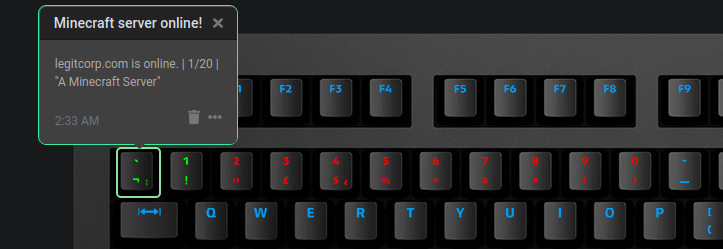

# Minecraft Server Status

Displays the status of your chosen Minecraft server as a row of colours on your keyboard.
The first key indicates if the server is online, following keys indicate the number of players.

[GitLab repository](https://gitlab.legitcorp.com/daskeyboard/minecraft-server-status)

## Example

Example where the Minecraft server is online, but there are no players.

Example where the Minecraft server is online, and there is 1 player.

Example where the Minecraft server is offline.

