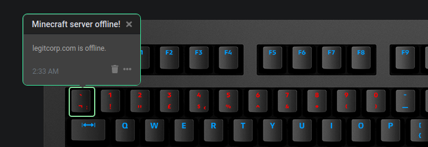

# Q Applet: Minecraft Server Status User Guide

Displays the status of your chosen Minecraft server as a row of colours on your keyboard.
The first key indicates the server is online, proceeding keys indicator the number of players, up to 10 keys.

[GitLab repository](https://gitlab.legitcorp.com/daskeyboard/minecraft-server-status)

## Example

Example where the Minecraft server is online, but there are no players.

Example where the Minecraft server is online, and there is 1 player.

Example where the Minecraft server is offline.

## Changelog

[CHANGELOG.MD](CHANGELOG.md)

## Installation

Requires a Das Keyboard Q Series: www.daskeyboard.com

Installation, configuration and uninstallation of applets is done within
the Q Desktop application (<https://www.daskeyboard.com/q>)

1. Position the row over your desired keys.

2. Enter the server's IP address, port colour for online and offline.

